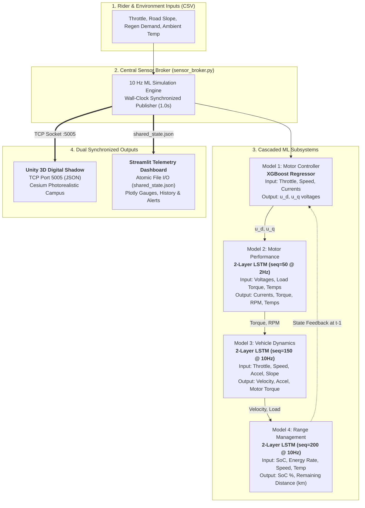

# 🛵 Behavioral Digital Twin of an Electric Two-Wheeler (E-Scooter)
<!--
[](https://www.python.org/)
[](https://www.tensorflow.org/)
[](https://xgboost.readthedocs.io/)
[](https://streamlit.io/)
[](https://unity.com/)
[](LICENSE)
-->

A closed-loop, data-driven **Behavioral Digital Twin (DT)** and **3D Geospatial Digital Shadow** for an electric two-wheeler (e-scooter). 

This system integrates four interconnected machine learning subsystems (XGBoost and deep sequence LSTMs) into a real-time **10 Hz closed-loop feedback pipeline**. It features **physics-grounded transfer learning** from automotive and dynamometer datasets, sub-second wall-clock synchronization via a central **Sensor Broker**, an interactive **Streamlit Telemetry Dashboard**, and a **Cesium-anchored Unity 3D visualization**.

---

## 📌 Table of Contents
- [System Architecture](#-system-architecture)
- [Four-Subsystem ML Pipeline](#-four-subsystem-ml-pipeline)
- [Physics + Data-Driven Transfer Learning](#-physics--data-driven-transfer-learning)
- [Unity 3D Geospatial Digital Shadow](#-unity-3d-geospatial-digital-shadow)
- [Repository Structure](#-repository-structure)
- [Evaluation & Benchmark Results](#-evaluation--benchmark-results)
- [Getting Started](#-getting-started)
  - [Prerequisites](#prerequisites)
  - [Installation](#installation)
  - [Running the Simulation & Dashboard](#running-the-simulation--dashboard)
  - [Connecting the Unity 3D Digital Shadow](#connecting-the-unity-3d-digital-shadow)
- [Synthetic Scenario Generation](#-synthetic-scenario-generation)
- [Academic Conference Paper](#-academic-conference-paper)
- [License](#-license)

---

## 🏗 System Architecture

The digital twin executes in a continuous **cascaded closed-loop feedback loop** at 10 Hz ($\Delta t = 0.1\text{ s}$). At each timestep, rider control commands feed into the motor controller, propagating sequentially through the motor, vehicle dynamics, and range management models before feeding back state variables into the next step.



### Communication & Synchronization
| Path | Protocol | Frequency | Payload |
| :--- | :--- | :--- | :--- |
| **Broker $\to$ Unity** | TCP Socket (`127.0.0.1:5005`) | 1.0 s wall-clock | JSON: `speed`, `rpm`, `motor_temp`, `soc`, `remaining_range`, `torque`, `throttle`, `gps_lat`, `gps_lon` |
| **Broker $\to$ Dashboard** | Atomic File I/O (`shared_state.json`) | 1.0 s wall-clock | Full state snapshot, alerts, and rolling 300-step time-series history |
| **Dashboard $\to$ UI** | Streamlit Live Auto-refresh | 1.0 s | Interactive Plotly gauges, time-series charts, and thermal warning alerts |

---

## 🧠 Four-Subsystem ML Pipeline

| Subsystem | Algorithm | Temporal Lookback | Inputs | Predicted Targets | Why This Architecture? |
| :--- | :--- | :--- | :--- | :--- | :--- |
| **1. Motor Controller** | `XGBoost` MultiOutput | Stateless ($t$) | `throttle_proxy`, $i_d^{t-1}, i_q^{t-1}, \omega^{t-1}, T_{pm}^{t-1}, T_{stator}^{t-1}, T_{amb}, D^{t-1}$ | $u_d, u_q$ (Phase voltages) | Instantaneous algebraic mapping; requires no multi-second memory; trains in seconds. |
| **2. Motor Performance** | 2-Layer `LSTM` | 50 steps (25s @ 2Hz) | $u_d, u_q, i_d, i_q, \omega, T_{pm}, T_{stator}, T_{tooth}, T_{yoke}, T_{amb}, T_{load}$ | $i_d, i_q, T_{em}, N_{rpm}, T_{pm}, T_{stator}$ | Captures electromechanical transients and thermal inertia (heat dissipation / accumulation). |
| **3. Vehicle Dynamics** | 2-Layer `LSTM` | 150 steps (15s @ 10Hz) | Throttle, Velocity, Longitudinal Acceleration, Motor Torque, Road Slope, Regen Signal | Velocity ($v$), Acceleration ($a$), Motor Torque ($T_{dyn}$) | Captures vehicle momentum, road gradient trends, and sustained acceleration/braking. |
| **4. Range Management** | 2-Layer `LSTM` | 200 steps (20s @ 10Hz) | $\text{SoC}$, Specific Energy Rate ($E_{norm}$), Velocity, Throttle, Road Slope, Battery Temp | State-of-Charge ($\text{SoC}$), Remaining Range ($d_{rem}$) | Learns multi-second battery drain patterns, grade impact, and thermal efficiency factors. |

---

## ⚡ Physics + Data-Driven Transfer Learning

Public telemetry for light electric scooters is scarce. This project implements a **physics-grounded cross-domain transfer framework** that adapts large-scale automotive datasets (BMW i3, 10 Hz) and industrial dynamometer benchmarks (Paderborn PMSM, 2 Hz) to an e-scooter operational domain ($90\text{ kg}$ total mass, $446\text{ Wh}$ battery, $25\text{ km/h}$ max speed).

### 1. Mass-Normalized Specific Energy Transfer
Specific tractive energy per unit mass ($E_{norm}$ in $\text{Wh/kg}$) is vehicle-size independent across similar driving cycles:
$$P_{bat} = -V_{bat} \cdot I_{bat} \quad [\text{W}]$$
$$E_{step} = \frac{P_{bat} \cdot \Delta t}{3600} \quad [\text{Wh}], \quad E_{norm} = \frac{E_{step}}{m_{BMW}} \quad \left[\frac{\text{Wh}}{\text{kg}}\right]$$
$$E_{scooter}(t) = E_{norm}(t) \cdot m_{scooter} \quad [\text{Wh}]$$

### 2. Kinematic Velocity & Torque Scaling
To keep neural network activations within training distributions while displaying realistic scooter kinematics:
$$v_{scooter} = v_{BMW} \cdot \left(\frac{v_{max}^{scooter}}{v_{max}^{BMW}}\right) = v_{BMW} \cdot \left(\frac{25.0}{150.0}\right)$$
$$T_{scooter} = T_{BMW} \cdot \left(\frac{m_{scooter}}{m_{BMW}}\right) = T_{BMW} \cdot \left(\frac{90}{1270}\right)$$

### 3. Trip-Level Efficiency Ground Truth (Stable Range Metric)
Rather than using noisy rolling efficiency ($\sum E / \sum d$), remaining range is derived from whole-trip energy density:
$$\eta_{trip} = \frac{\sum |E_{norm}| \cdot m_{BMW} \cdot \Delta t}{\sum \left(\frac{v}{3.6} \cdot \Delta t\right)}, \quad \eta_{scooter} = \eta_{trip} \cdot \left(\frac{m_{scooter}}{m_{BMW}}\right)$$
$$d_{rem}(t) = \text{clip}\left( \frac{\text{SoC}(t)}{100} \cdot \frac{E_{bat}^{scooter}}{\eta_{scooter}}, 0.0, 100.0 \right) \quad [\text{km}]$$

### 4. Closed-Loop Stability & Edge Cases
* **Decoupled Throttle Proxy:** Uses exogenous rider throttle rather than unconstrained current derivations, preventing cold-start motor braking deadlocks.
* **LSTM Cold-Start Pre-filling:** Sequence buffers are pre-filled on step 0 with physically consistent idle state vectors to eliminate cold-start warmup spikes.
* **Thermodynamic SoC Monotonicity:** Post-prediction constraints prevent non-physical battery charging during motoring while allowing regenerative energy recovery during braking.

---

## 🎮 Unity 3D Geospatial Digital Shadow

The virtual representation is built in Unity 3D integrated with **Cesium for Unity 3D Tiles**, georeferenced at **IIIT Sri City ($13.5558^\circ\text{ N}, 80.0269^\circ\text{ E}$)**:

* **Dual-Raycast Wheelbase Ground Snapping (`RoadFollower.cs`):** Casts independent rays from front and rear wheel hubs to accurately calculate chassis pitch angle $\psi = \arctan\left(\frac{y_{front} - y_{rear}}{L_{wheelbase}}\right)$ on slopes.
* **Kinematic Wheel Rotation (`ScooterAnimator.cs`):** Rotates wheel transforms around local axes based on ground speed: $\Delta \theta = \frac{v}{2\pi R_{wheel}} \cdot 360^\circ \cdot \Delta t$.
* **Real-time Path Minimap (`PathMapUI.cs`):** Renders dynamic path traces on a HUD texture using Bresenham's algorithm, with hotkeys (`S` / `H`) to export vector snapshots.
* **Supervisory Alert Overlay (`UIUpdater.cs`):** Displays real-time speed, RPM, battery SoC, and triggers visual warnings when $T_{pm} > 80^\circ\text{C}$ or $\text{SoC} < 20\%$.

---

## 📂 Repository Structure

```text
├── .gitignore                      # Git rules (excludes large datasets >100MB & Unity cache)
├── requirements.txt                # Python package dependencies
├── Hardware_Architecture.drawio    # System hardware & software architecture diagram
├── sensor_broker.py                # 10 Hz central simulation broker & TCP telemetry publisher
├── validate_digital_twin.py        # 500-step closed-loop feedback validation suite
├── confirm_drift.py                # Multi-trip error accumulation & drift analysis
├── eda_escooter_dt.py              # Exploratory data analysis for both datasets
│
├── preprocess_paderborn.py         # Physics-informed preprocessing for Paderborn PMSM
├── preprocess_bmw_i3.py            # Physics-informed preprocessing for BMW i3 cycles
├── model_controller.py             # Train XGBoost Motor Controller
├── model_motor.py                  # Train 2-Layer LSTM Motor Dynamics Model
├── model_dynamics_lstm.py          # Train 2-Layer LSTM Vehicle Dynamics Model
├── model_range_lstm.py             # Train Dual-Target LSTM Range Model
│
├── dashboard/                      # Interactive Streamlit Telemetry Dashboard
│   ├── app.py                      # Main dashboard application
│   ├── models.py                   # Runtime step execution & alert logic
│   ├── charts.py                   # Plotly telemetry charts & gauges
│   ├── state.py                    # Rolling history buffer manager
│   └── styles.py                   # Custom dark glassmorphism CSS theme
│
├── Ride_data_generation/           # Synthetic Scenario Generators & Test CSVs
│   ├── generate_aggressive_rider.py
│   ├── generate_highway_cruise.py
│   ├── generate_hill_climb.py
│   ├── generate_urban_commute.py
│   ├── generate_winter_cold_start.py
│   └── synthetic_inputs/           # Ready-to-run scenario CSV files
│
├── Models/                         # Pre-trained neural nets, tree models & scalers (~25 MB)
│   ├── controller_model.joblib
│   ├── motor_model.keras
│   ├── dynamics_lstm_model.keras
│   ├── range_lstm_model.keras
│   └── *_scaler.joblib
│
├── EV_DT/                          # Clean Unity 3D Project Source (No Library cache)
│   ├── Assets/                     # C# scripts, 3D FBX models, Materials & Shaders
│   ├── Packages/manifest.json      # Unity package dependencies (Cesium, URP)
│   └── ProjectSettings/            # Engine configuration
│
├── Plots/                          # Training curves, parity scatter plots & residual checks
├── Results/                        # Multi-scenario dynamic simulation result benchmarks
└── Paper/                          # Formal IEEE Conference Paper LaTeX source code & draft
    └── IEEE_Conference_Paper.tex
```

---

## 📊 Evaluation & Benchmark Results

### Individual Subsystem Test Performance
Evaluated on independent, held-out test splits:

| Subsystem | Target Variable | Unit | RMSE | MAE | $\mathbf{R^2}$ Score |
| :--- | :--- | :---: | :---: | :---: | :---: |
| **Motor Controller** | Direct Voltage ($u_d$) | V | 2.6586 | 1.6896 | **0.9981** |
| | Quadrature Voltage ($u_q$) | V | 3.5902 | 2.2578 | **0.9940** |
| **Motor Performance** | Direct Current ($i_d$) | A | 3.8206 | 2.4428 | **0.9960** |
| | Quadrature Current ($i_q$) | A | 4.6980 | 3.1733 | **0.9969** |
| | Shaft Torque ($T_{em}$) | $\text{N}\cdot\text{m}$ | 3.7350 | 2.3660 | **0.9972** |
| | Motor Speed ($N_{rpm}$) | RPM | 115.0488 | 97.5391 | **0.9963** |
| | Rotor Temp ($T_{pm}$) | $^\circ\text{C}$ | 1.0190 | 0.7966 | **0.9932** |
| | Stator Winding ($T_{stator}$) | $^\circ\text{C}$ | 1.7177 | 1.3158 | **0.9935** |
| **Vehicle Dynamics** | Speed ($v$) | km/h | 0.8800 | 0.7118 | **0.9994** |
| | Acceleration ($a$) | $\text{m/s}^2$ | 0.0926 | 0.0620 | **0.9774** |
| | Motor Torque ($T_{dyn}$) | $\text{N}\cdot\text{m}$ | 1.6799 | 1.0995 | **0.9976** |
| **Range Management** | State-of-Charge ($\text{SoC}$) | % | 0.3249 | 0.2130 | **0.9993** |
| | Remaining Distance ($d_{rem}$) | km | 0.3556 | 0.1829 | **0.9989** |

### Closed-Loop Multi-Model Feedback Validation (500 Timesteps)
Running all 4 models continuously in feedback loop without ground-truth reset:
* Direct Voltage $u_d$ $\text{RMSE} = 3.507\text{ V}$
* Quadrature Voltage $u_q$ $\text{RMSE} = 2.831\text{ V}$
* Rotor Temperature $T_{pm}$ $\text{RMSE} = 0.637^\circ\text{C}$
* Vehicle Velocity $\text{RMSE} = 0.096\text{ km/h}$
* Battery State-of-Charge $\text{SoC}$ $\text{RMSE} = 0.419\%$
* **Drift Check:** Error growth across 5 sequential 100-step windows stabilized with zero runaway divergence.

---

## 🚀 Getting Started

### Prerequisites
* Python 3.9, 3.10, or 3.11
* Unity 2022.3 LTS or Unity 6 (Optional, for 3D digital shadow)
* Git

### Installation
1. **Clone the repository:**
   ```bash
   git clone https://github.com/gr-yoga-20-12/Digital-twin-for-an-Electric-two-wheeler.git
   cd Digital-twin-for-an-Electric-two-wheeler
   ```

2. **Create and activate a virtual environment:**
   ```bash
   # On Windows (PowerShell)
   python -m venv .venv
   .venv\Scripts\Activate.ps1

   # On Linux/macOS
   python3 -m venv .venv
   source .venv/bin/activate
   ```

3. **Install dependencies:**
   ```bash
   pip install -r requirements.txt
   ```

---

### Running the Simulation & Dashboard

The system runs via a producer-consumer model where `sensor_broker.py` drives the simulation and `dashboard/app.py` renders telemetry.

1. **Terminal 1 — Start the Sensor Broker:**
   ```bash
   python sensor_broker.py urban_commute_inputs.csv 90
   ```
   * *Arguments:* `<scenario_csv_path> [initial_soc_percent]` (Default SoC: 80%).

2. **Terminal 2 — Start the Streamlit Dashboard:**
   ```bash
   streamlit run dashboard/app.py
   ```
   * Open your browser at <!-- http://localhost:8501 --> `Your_Local_Host`  to view live gauges, battery drain curves, and motor thermal alerts.

---

### Connecting the Unity 3D Digital Shadow (Optional)
1. Open Unity Hub and add the `EV_DT/` project folder.
2. Open `Assets/Scenes/SampleScene.unity`.
3. Press the **Play** button in Unity.
4. Launch `sensor_broker.py` in your terminal.
5. The 3D e-scooter will automatically connect over TCP port 5005, following the road waypoints at IIIT Sri City with active wheel rotation, chassis pitch calculation, and live HUD metrics.

---

## 🧪 Synthetic Scenario Generation

You can generate custom driving test cycles with realistic Gaussian noise and AR(1) random walks using the scripts in `Ride_data_generation/`:

```bash
# Generate specific stress scenario
python generate_aggressive_rider.py
python generate_hill_climb.py
python generate_winter_cold_start.py
```
Output CSVs contain columns: `step, time_s, throttle, slope, regen, ambient_temp, trip_type`.

---

<!--
## 📄 Academic Conference Paper

A complete, formal conference paper written in IEEE two-column format is included in the [`Paper/`](Paper/) directory:
* **LaTeX Source:** [`Paper/IEEE_Conference_Paper.tex`](Paper/IEEE_Conference_Paper.tex)
* **Title:** *A Cascaded Data-Driven Behavioral Digital Twin for Electric Two-Wheelers: Cross-Domain Transfer, Temporal Modeling, and 3D Geospatial Co-Simulation*
* **Format:** Standard `\documentclass[conference]{IEEEtran}` ready for LaTeX compilation.

---


## 📜 License

This project is licensed under the MIT License — see the [LICENSE](LICENSE) file for details.

-->
